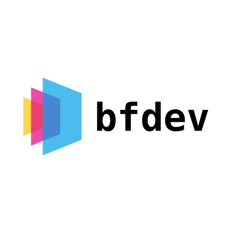

#  BFDEV Introduce

bfdev is a high-performance, aesthetically pleasing, and portable infrastructure provisioning library. Its goal is to provide a comprehensive and streamlined development environment.



## Continuous Integration Status
| Status (master) | Status (devel)| Description|
|-------------|-------------|------------------|
|  [](https://github.com/openbfdev/bfdev/actions/workflows/ubuntu-gcc.yml?query=branch%3Amain) | [](https://github.com/openbfdev/bfdev/actions/workflows/ubuntu-gcc.yml?query=branch%3Amain) | Build default config on Ubuntu gcc |
|  [](https://github.com/openbfdev/bfdev/actions/workflows/ubuntu-clang.yml?query=branch%3Amain) | [](https://github.com/openbfdev/bfdev/actions/workflows/ubuntu-clang.yml?query=branch%3Amain) | Build default config on Ubuntu clang |
|  [](https://github.com/openbfdev/bfdev/actions/workflows/macos.yml?query=branch%3Amain) | [](https://github.com/openbfdev/bfdev/actions/workflows/macos.yml?query=branch%3Amain) | Build default config on Macos |
|  [](https://github.com/openbfdev/bfdev/actions/workflows/codeql.yml?query=branch%3Amain) | [](https://github.com/openbfdev/bfdev/actions/workflows/codeql.yml?query=branch%3Amain) | Code analyse on codeql |

## Why Choose

- The library provides common data structures, eliminating the need to reinvent the wheel.
- Supports dynamic checking of data structures.
- Designed with an object-oriented approach, providing compatibility with various project.
- Offers a rich and well-organized set of APIs for users.
- Conforms to the GNUC standard, ensuring strong cross-platform compatibility.

### WARNING
This project is not yet fully completed, so it is not recommended for use in a production environment.

## Directory Structure

```
.
├── arch
├── cmake
├── docs
├── examples
├── include
├── scripts
└── src
```

|   Directory   |  Description              |
|:-------------:|:-------------------------:|
| arch          | ISA related code          |
| cmake         | cmake configuration file  |
| docs          | doc for guiding           |
| exampes       | unit testing and case     |
| include       | include path              |
| scripts       | build scripts             |
| src           | core code path            |

## Reference Path

```mermaid
graph LR
    include[include]
    include/asm-generic[asm-generic]
    arch/asm[asm]
   	arch/asm-generated{exist}

    subgraph target[User Installation]
    	include/bfdev[bfdev]
    	include/bfdev/asm-generic[bfdev:asm-generic]
    	arch/bfdev/asm[bfdev:asm]
   		arch/bfdev/asm-generated{exist}
    end

    include --> arch/asm-generated
    arch/asm-generated --Y--> arch/asm
    arch/asm -.-> include/asm-generic
    arch/asm-generated --N--> include/asm-generic
    include/bfdev --> arch/bfdev/asm-generated
    arch/bfdev/asm-generated --Y--> arch/bfdev/asm
    arch/bfdev/asm-generated --N--> include/bfdev/asm-generic
    arch/bfdev/asm -.-> include/bfdev/asm-generic
   	include --> include/bfdev
   	arch/asm --> arch/bfdev/asm
   	include/asm-generic --> arch/bfdev/asm
```

## Documentation Tutorial

Quickly start, API manual, see [Bfdev Documentation Tutorial](https://bfdev.github.io/)
